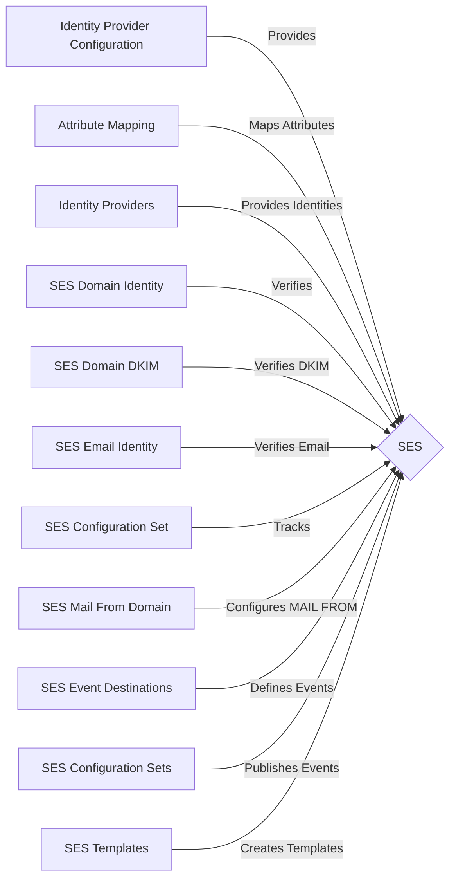

<!-- BEGIN_TF_DOCS -->
# 📧 SES (Simple Email Service) module
## Description

This module provides the following capabilities:
* 🚀 **Identity Provider Configuration**: It allows you to set up an identity provider for a user pool, including the provider name, type, and details such as the access token.
* 🔑 **Attribute Mapping**: This module supports the mapping of user pool attributes.
* 🎣 **Identity Providers**: You can specify a list of identity providers.
* 📬 **SES Domain Identity**: It creates and verifies an SES domain identity.
* 📝 **SES Domain DKIM**: It generates and verifies DomainKeys Identified Mail (DKIM) tokens for the SES domain.
* 💌 **SES Email Identity**: It creates and verifies an email identity for the SES domain.
* 📦 **SES Configuration Set**: It creates a configuration set for the SES domain, which can be used to track bounce and complaint metrics.
* 🚚 **SES Mail From Domain**: It configures a custom MAIL FROM domain and behavior for the SES domain.
* 📨 **SES Event Destinations**: This module can create event destinations for your configuration set. Event destinations define where Amazon SES sends the events that are associated with a configuration set.
* 📜 **SES Configuration Sets**: Configuration sets enable you to publish email sending events to Amazon CloudWatch or Amazon Kinesis Firehose.
* 📃 **SES Templates**: A template is a set of replacement variables for common pieces of content that you can reuse in multiple email messages.

---
## Example
Examples of this module's usage are available in the [examples](./examples) folder.

```hcl
module "main_module" {
  source     = "../../../modules/ses"
  is_enabled = var.is_enabled
  aws_region = var.aws_region

  // Specific module configuration
  ses_config                   = var.ses_config
  ses_verification_config      = var.ses_verification_config
  ses_validation_config        = var.ses_validation_config
  ses_notification_config      = var.ses_notification_config
  ses_template_config          = var.ses_template_config
  ses_event_destination_config = var.ses_event_destination_config

  tags = var.tags
}
```
## Recipes
### Very basic configuration.
```hcl
  aws_region = "us-east-1"
is_enabled = true

ses_config = {
  name   = "ses-config1"
  domain = "sandbox.4id.network"
}
```

---

## Module's documentation
(This documentation is auto-generated using [terraform-docs](https://terraform-docs.io))
## Providers

| Name | Version |
|------|---------|
| <a name="provider_aws"></a> [aws](#provider\_aws) | 5.23.1 |

## Modules

No modules.

## Resources

| Name | Type |
|------|------|
| [aws_route53_record.dkim_cname](https://registry.terraform.io/providers/hashicorp/aws/latest/docs/resources/route53_record) | resource |
| [aws_route53_record.mail_from_mx](https://registry.terraform.io/providers/hashicorp/aws/latest/docs/resources/route53_record) | resource |
| [aws_route53_record.spf_txt](https://registry.terraform.io/providers/hashicorp/aws/latest/docs/resources/route53_record) | resource |
| [aws_route53_record.this](https://registry.terraform.io/providers/hashicorp/aws/latest/docs/resources/route53_record) | resource |
| [aws_ses_configuration_set.this](https://registry.terraform.io/providers/hashicorp/aws/latest/docs/resources/ses_configuration_set) | resource |
| [aws_ses_domain_dkim.this](https://registry.terraform.io/providers/hashicorp/aws/latest/docs/resources/ses_domain_dkim) | resource |
| [aws_ses_domain_identity.this](https://registry.terraform.io/providers/hashicorp/aws/latest/docs/resources/ses_domain_identity) | resource |
| [aws_ses_domain_identity_verification.this](https://registry.terraform.io/providers/hashicorp/aws/latest/docs/resources/ses_domain_identity_verification) | resource |
| [aws_ses_domain_mail_from.this](https://registry.terraform.io/providers/hashicorp/aws/latest/docs/resources/ses_domain_mail_from) | resource |
| [aws_ses_email_identity.this](https://registry.terraform.io/providers/hashicorp/aws/latest/docs/resources/ses_email_identity) | resource |
| [aws_ses_event_destination.event_cloudwatch](https://registry.terraform.io/providers/hashicorp/aws/latest/docs/resources/ses_event_destination) | resource |
| [aws_ses_event_destination.event_kinesis_firehose](https://registry.terraform.io/providers/hashicorp/aws/latest/docs/resources/ses_event_destination) | resource |
| [aws_ses_event_destination.event_sns](https://registry.terraform.io/providers/hashicorp/aws/latest/docs/resources/ses_event_destination) | resource |
| [aws_ses_identity_notification_topic.notification_ooo](https://registry.terraform.io/providers/hashicorp/aws/latest/docs/resources/ses_identity_notification_topic) | resource |
| [aws_ses_identity_notification_topic.this](https://registry.terraform.io/providers/hashicorp/aws/latest/docs/resources/ses_identity_notification_topic) | resource |
| [aws_ses_template.this](https://registry.terraform.io/providers/hashicorp/aws/latest/docs/resources/ses_template) | resource |
| [aws_sns_topic.notification_topic_ooo](https://registry.terraform.io/providers/hashicorp/aws/latest/docs/resources/sns_topic) | resource |
| [aws_iam_policy_document.notification_topic_policy](https://registry.terraform.io/providers/hashicorp/aws/latest/docs/data-sources/iam_policy_document) | data source |
| [aws_region.this](https://registry.terraform.io/providers/hashicorp/aws/latest/docs/data-sources/region) | data source |
| [aws_route53_zone.this](https://registry.terraform.io/providers/hashicorp/aws/latest/docs/data-sources/route53_zone) | data source |

## Requirements

| Name | Version |
|------|---------|
| <a name="requirement_terraform"></a> [terraform](#requirement\_terraform) | >= 1.6.0 |
| <a name="requirement_aws"></a> [aws](#requirement\_aws) | ~> 5.23.1 |

## Inputs

| Name | Description | Type | Default | Required |
|------|-------------|------|---------|:--------:|
| <a name="input_aws_region"></a> [aws\_region](#input\_aws\_region) | AWS region to deploy the resources | `string` | n/a | yes |
| <a name="input_is_enabled"></a> [is\_enabled](#input\_is\_enabled) | Whether this module will be created or not. It is useful, for stack-composite<br>modules that conditionally includes resources provided by this module.. | `bool` | n/a | yes |
| <a name="input_ses_config"></a> [ses\_config](#input\_ses\_config) | A list of SES configurations to create. Each item in the list must have the following attributes:<br>  - name: A terraform identifier used in the context of resource configuration only, not in the actual SES configuration.<br>  - domain: The domain to associate with the SES configuration. E.g: example.com, if it's not passed,<br>the SES configuration will set the 'domain' with the 'name' attribute value. E.g: example.com<br>  - create\_domain\_mail\_from: Whether to create a domain mail from or not. Default: false<br>  - behavior\_on\_mx\_failure: The action that you want Amazon SES to take if it cannot successfully read the required MX record when you send an email. Default: UseDefaultValue<br>  - emails: A list of emails to create. Each item in the list must have the following attributes:<br>    - address: The email address to create.<br>    - enabled: Whether the email is enabled or not. Default: true | <pre>object({<br>    name                    = string<br>    domain                  = optional(string, null)<br>    create_domain_mail_from = optional(bool, false)<br>    behavior_on_mx_failure  = optional(string, "UseDefaultValue")<br>    emails = optional(list(object({<br>      address = string<br>      enabled = optional(bool, true)<br>    })), [])<br>  })</pre> | n/a | yes |
| <a name="input_ses_event_destination_config"></a> [ses\_event\_destination\_config](#input\_ses\_event\_destination\_config) | A list of SES event destination configurations to create. Each item in the list must have the following attributes:<br>  - name: A terraform identifier used in the context of resource configuration only, not in the actual SES configuration.<br>  - enabled: Whether the event destination is enabled or not. Default: true<br>  - matching\_types: A list of event types to send to the event destination. Default: ["reject", "bounce", "renderingFailure"]<br>  - cloudwatch\_destination: A cloudwatch destination configuration. If this attribute is not passed, the SES will not create a cloudwatch destination.<br>  - kinesis\_destination: A kinesis destination configuration. If this attribute is not passed, the SES will not create a kinesis destination.<br>  - sns\_destination: A sns destination configuration. If this attribute is not passed, the SES will not create a sns destination. | <pre>list(object({<br>    name           = string<br>    enabled        = optional(bool, true)<br>    matching_types = optional(list(string), ["reject", "bounce", "renderingFailure"])<br>    cloudwatch_destination = optional(object({<br>      default_value  = string<br>      dimension_name = string<br>      value_source   = optional(string, "messageTag")<br>    }), null)<br>    kinesis_destination = optional(object({<br>      role_arn   = string<br>      stream_arn = string<br>    }), null)<br>    sns_destination = optional(object({<br>      topic_arn = optional(string, null) // if it's not set, it'll create a new topic<br>    }), null)<br>  }))</pre> | `null` | no |
| <a name="input_ses_notification_config"></a> [ses\_notification\_config](#input\_ses\_notification\_config) | A list of SES notification configurations to create. Each item in the list must have the following attributes:<br>  - name: A terraform identifier used in the context of resource configuration only, not in the actual SES configuration.<br>  - topic\_arn: The ARN of the SNS topic to notify when Amazon SES receives an email on behalf of one or more of the email addresses associated with the configuration set. If this attribute is not passed, the SES<br>will create a new SNS topic and associate it with the configuration set.<br>  - notification\_type: The type of notifications that you want to receive. Default: Bounce<br>  - include\_original\_headers: Whether to include original headers in the notifications or not. Default: false | <pre>object({<br>    name                     = string<br>    topic_arn                = optional(string, null)<br>    notification_type        = optional(string, "Bounce")<br>    include_original_headers = optional(bool, false)<br>  })</pre> | `null` | no |
| <a name="input_ses_template_config"></a> [ses\_template\_config](#input\_ses\_template\_config) | A list of SES template configurations to create. Each item in the list must have the following attributes:<br>  - name: A terraform identifier used in the context of resource configuration only, not in the actual SES configuration.<br>  - subject: The subject line of the email.<br>  - html: The HTML body of the email. If this attribute is not passed, the SES will not create a HTML template.<br>  - text: The text body of the email. If this attribute is not passed, the SES will not create a text template. | <pre>list(object({<br>    name    = string<br>    subject = string<br>    html    = optional(string, null)<br>    text    = optional(string, null)<br>  }))</pre> | `null` | no |
| <a name="input_ses_validation_config"></a> [ses\_validation\_config](#input\_ses\_validation\_config) | A list of SES validation configurations to create. Each item in the list must have the following attributes:<br>  - name: A terraform identifier used in the context of resource configuration only, not in the actual SES configuration.<br>  - enable\_spf\_validation: Whether to enable SPF validation or not. Default: false<br>  - enable\_dkim\_validation: Whether to enable DKIM validation or not. Default: false | <pre>object({<br>    name                   = string<br>    enable_spf_validation  = optional(bool, false)<br>    enable_dkim_validation = optional(bool, false)<br>  })</pre> | `null` | no |
| <a name="input_ses_verification_config"></a> [ses\_verification\_config](#input\_ses\_verification\_config) | A list of SES verification configurations to create. Each item in the list must have the following attributes:<br>  - name: A terraform identifier used in the context of resource configuration only, not in the actual SES configuration.<br>  - ttl: The TTL of the verification record in seconds. Default: 600<br>  - enabled: Whether the verification record is enabled or not. Default: true | <pre>object({<br>    name    = string<br>    ttl     = optional(number, 600)<br>    enabled = optional(bool, true)<br>  })</pre> | `null` | no |
| <a name="input_tags"></a> [tags](#input\_tags) | A map of tags to add to all resources. | `map(string)` | `{}` | no |

## Outputs

| Name | Description |
|------|-------------|
| <a name="output_aws_region_for_deploy_this"></a> [aws\_region\_for\_deploy\_this](#output\_aws\_region\_for\_deploy\_this) | The AWS region where the module is deployed. |
| <a name="output_is_enabled"></a> [is\_enabled](#output\_is\_enabled) | Whether the module is enabled or not. |
| <a name="output_ses_config"></a> [ses\_config](#output\_ses\_config) | The SES configuration passed |
| <a name="output_ses_configuration_sets"></a> [ses\_configuration\_sets](#output\_ses\_configuration\_sets) | The SES configuration sets |
| <a name="output_ses_domain_identity"></a> [ses\_domain\_identity](#output\_ses\_domain\_identity) | The SES domain identity |
| <a name="output_ses_domain_identity_arn"></a> [ses\_domain\_identity\_arn](#output\_ses\_domain\_identity\_arn) | The SES domain identity ARN |
| <a name="output_ses_domain_identity_verification_token"></a> [ses\_domain\_identity\_verification\_token](#output\_ses\_domain\_identity\_verification\_token) | The SES domain identity verification token |
| <a name="output_ses_identities_id"></a> [ses\_identities\_id](#output\_ses\_identities\_id) | The SES identities ids |
| <a name="output_ses_mail_from_domain"></a> [ses\_mail\_from\_domain](#output\_ses\_mail\_from\_domain) | The SES mail from domain |
| <a name="output_tags_set"></a> [tags\_set](#output\_tags\_set) | The tags set for the module. |

---
## Mermaid Diagram

<!-- END_TF_DOCS -->
